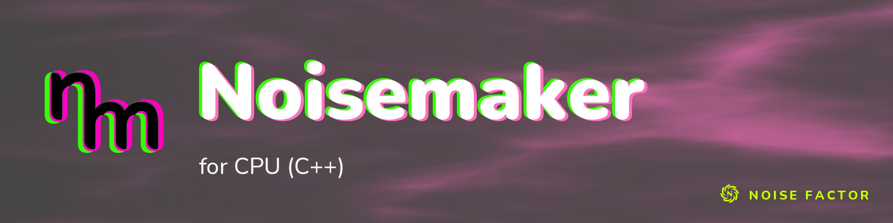

<!-- repo-hero -->
<a href="https://noisemaker.app/"></a>

<sub>Open source from <a href="https://noisefactor.io">Noise Factor</a> &middot; <a href="https://github.com/noisefactorllc">more projects</a></sub>

# noisemaker-for-cpp

> This package supports the "Export Shader Pipeline" feature in Noisedeck.app. The feature runs shader compositions on other platforms. Noise Factor derives this package from the upstream Noisemaker Engine project. It is not yet at full parity with `noisemaker-for-cpu`: see [Coverage](#coverage) for the measured gap.

A C++20 CPU port of the [Noisemaker](https://noisemaker.app) shader engine.

This renders Noisemaker's GLSL effect catalog on the CPU, with no GPU, no
GLSL driver, and no runtime shader compilation. It is a sibling of
`noisemaker-for-cpu` (JavaScript) and targets bit-level parity with it.

The library has no dependencies beyond a C++20 compiler and zlib.

## How it works

Effects are **not** hand-written C++. A typed generator in `tools/glslcpp/` compiles the pinned GLSL corpus ahead of time into C++20:

1. Each GLSL program is parsed and semantically analyzed into a typed IR.
2. A per-program structural profile authenticates the exact AST closure that
   program uses.
3. A validator admits **only** that authenticated closure and independently
   rejects nearby unsupported shapes.
4. An emitter — which re-authenticates from scratch rather than trusting the
   validator — lowers the typed AST to C++20.

The generated output is committed to the tree, so building this repository
requires no Python and no code generation:

- `src/typed_generated/typed_slice.cpp`
- `src/typed_generated/typed_manifest.json`
- `include/noisemaker/generated/catalog.hpp`

Generation is deterministic. `python -m tools.glslcpp.generate_typed_slice
--check` regenerates everything in memory and fails if the committed output
differs by a single byte. CI runs that check on every push.

## Coverage

This port is **in progress** and is measured against a pinned JavaScript authority,
`noisemaker-for-cpu` at `61aa8694d60e6e25d8d3e8c872c971be329458bc`, which itself pins the
upstream Noisemaker shaders at `0ed489ec46842bffba33ee2ec65a218b6dda51f5`. CI checks out that
exact authority commit; it does not follow the authority's `main`.

| | Count | Derived from |
|---|---:|---|
| Effect definitions in the authority | 208 | `counts.definitions` in `src/effects/generated/effect_catalog.provenance.json` |
| Effects this port can execute | 167 | `counts.executable_definitions` in the same file |
| Effects with at least one unported pass | 41 | `counts.incomplete_definitions` in the same file |
| Effects listed by this port's export kit | 160 | `export-kit/compat-effects.json` |
| Effects listed by the authority's export kit | 205 | `export-kit/compat-effects.json` in the authority checkout |
| Corpus programs | 212 | the `programs` array in `tools/glslcpp/corpus/0ed489ec46842bffba33ee2ec65a218b6dda51f5/manifest.json` |
| Typed-slice programs | 211 | the `programs` array in `src/typed_generated/typed_manifest.json` |
| Catalog entries | 213 | `kCatalog` in `src/typed_generated/typed_slice.cpp`: the 211 typed program keys, plus a second, earlier-generation factory registered under `filter/invert:inv` and under `synth/solid:solid` |

Where the authority runs a hand-written adapter instead of its generated kernel, this port either routes the program to a hand-written C++ kernel (the `custom_adapter` routes) or proves its generated kernel equivalent to the adapter with an oracle package under `docs/port-engineering/`.

The remaining effects need runtime features this executor does not have yet: iterated simulations, particle groups, volume atlases, multi-render-target passes, and loop regions. The live list of remaining work is the top block of
[`docs/port-engineering/NEXT_CODING_AGENT_HANDOFF.md`](docs/port-engineering/NEXT_CODING_AGENT_HANDOFF.md).

The corpus itself is vendored, not authored here. Its GLSL sources under
`tools/glslcpp/corpus/` come from
[`noisefactorllc/noisemaker`](https://github.com/noisefactorllc/noisemaker) at
revision `0ed489ec46842bffba33ee2ec65a218b6dda51f5`, and are MIT-licensed
there. The earlier `a024dc3a960cc44af454abc7aebce50456c194e6` corpus is kept as frozen
evidence for the oracle packages that cite it.

### Parity and its documented exceptions

Pixel-level fixtures check ported programs against the JavaScript reference implementation. Compilation alone is insufficient. The project admits capabilities one authenticated closure at a time.

The project records each emitted kernel's *measured* divergence from the reference in code. `kMeasuredParityExclusions` in `src/graph/executor.cpp` lists each affected program and its measured divergence. The DSL graph
executor refuses to run an excluded program, raising `unavailable_pass`.

Read that list before treating any kernel's output as authority-exact. The guard applies only in the graph executor. The generated catalog still exposes an excluded program's `bind_*` factory. The guard does not apply to a direct `noisemaker::generated::bind()` call by key.

## Build

Requires CMake 3.20+, a C++20 compiler, and zlib.

```bash
cmake -S . -B build -DCMAKE_BUILD_TYPE=Release
cmake --build build -j
ctest --test-dir build --output-on-failure
```

The project compiles with `-Wall -Wextra -Wpedantic -Werror
-ffp-contract=off`. Floating-point contraction is disabled deliberately:
fused multiply-add would silently change results and break parity with the
reference.

## Use

### Render a DSL program

`noisemaker-render` is the command-line front end. Build it. Run it with a DSL program to produce a PNG:

```bash
cmake --build build --target noisemaker-render

./build/noisemaker-render tests/fixtures/dsl/blur.dsl   # writes blur.png
```

`cmake --install build --prefix <prefix>` also installs it to
`<prefix>/bin/noisemaker-render`, so the build-tree path below is a
convenience, not the only way to run it. The install is optional: a
library-only build (`cmake --build build --target noisemaker-cpu`) still
installs cleanly, without the executable.

With no options, it renders 512x512 at time 0, frame 0, seed 1. It writes to the current directory, using the program's own name with a `.png` extension. Every
option is optional and paths may be relative:

```bash
./build/noisemaker-render program.dsl -o out.png
./build/noisemaker-render program.dsl --width 512 --height 512 --seed 7 \
    --time 0.5 --frame 3
```

| option | default | meaning |
|---|---|---|
| `-o`, `--output PATH` | the program's basename + `.png` | PNG to write |
| `--width N` | 512 | pixels across |
| `--height N` | 512 | pixels down |
| `--time D` | 0 | animation time in seconds |
| `--frame N` | 0 | frame counter |
| `--seed D` | 1 | seed |
| `--raw-rgba8 PATH` | — | also write raw top-down RGBA8 bytes |
| `--metadata PATH` | — | also write a JSON document describing the render |

**No environment variables are needed to render.** The renderer reads nothing
but the program file you name. (The parity lane in
[Tests](#tests) is the only thing that needs the external JS authority.)

A DSL program names effects from the catalog. To see what is available:

```bash
./build/noisemaker-render --list-effects   # every catalog key, sorted
```

Rendering is fail-closed. If the executor refuses a program, the command reports the executor's reason and returns a nonzero exit status. It writes nothing:

```
$ ./build/noisemaker-render snow.dsl
noisemaker-render: snow.dsl cannot be rendered, so nothing was written.
  reason: the authority executes a hand-written CPU adapter for this program and the emitted typed kernel is measured divergent (499 of 748 RGBA8 bytes at 17x11)
  code:   unavailable_pass (7)
  effect: filter/snow, pass 0 "main" (filter/snow:snow)
```

`--help` prints the full option list and these exit codes:

- `0`: rendered.
- `2`: unusable command line.
- `4`: refused.
- `5`: plan authentication failure.
- `6`: output could not be written.

`noisemaker-render` uses the same compile/execute/export path as the corpus parity driver `noisemaker-dsl-cpu-case`. It produces the bytes that the parity lane validates. That driver is a *harness* tool. It requires absolute paths and a `--source-sha256` of its input to prove which bytes a corpus record ran. Use it only for the parity lane. To render a program, use `noisemaker-render`.

### Use the library directly

Much of this library is header-inline: every `noisemaker::glsl::` helper and the matrix and vector operators. These compile in *your* translation unit under *your* flags. `-ffp-contract=off` is therefore part of the public contract, not just this project's build. Without it, the compiler may fuse a multiply and an add into a single FMA and silently change results.

The exported CMake target carries the flag for you. Consuming the package with
`find_package(noisemaker-for-cpp CONFIG REQUIRED)` and linking
`NoisemakerForCpp::noisemaker-cpu` propagates both `-ffp-contract=off` and the
C++20 requirement to your targets. If you build without CMake, pass
`-std=c++20 -ffp-contract=off` yourself.

Bind a kernel by name. Run a pass. Encode the result:

```cpp
#include "noisemaker/generated/catalog.hpp"
#include "noisemaker/pass_runner.hpp"
#include "noisemaker/png.hpp"

noisemaker::glsl::Bindings bindings;
bindings.set_uniform("resolution", noisemaker::glsl::Vec2(256.0f, 256.0f));
bindings.set_uniform("scale", 4.0f);
bindings.set_uniform("seed", std::int32_t{7});
// ... remaining uniforms for this kernel

const noisemaker::BoundKernel kernel =
    noisemaker::generated::bind_synth_perlin_perlin(bindings);
const noisemaker::Surface surface =
    noisemaker::run_pass(kernel, 256, 256);
const std::vector<std::uint8_t> png = noisemaker::encode_png(surface);
```

You can also find kernels dynamically:

```cpp
const noisemaker::BoundKernel kernel =
    noisemaker::generated::bind("synth/perlin:perlin", bindings);

for (const auto& factory : noisemaker::generated::catalog()) {
  // factory.key, factory.bind
}
```

Binding is fail-closed with respect to uniforms: a missing or wrongly-typed
uniform throws `noisemaker::glsl::KernelBindingError` rather than rendering
something plausible. It does not consult the measured-parity exclusion list
described under [Coverage](#parity-and-its-documented-exceptions).

`BoundKernel` is a stateful execution handle, matching the JavaScript bound
factory it ports. It retains fragment output state across pixels and repeated
passes, and copies of one `BoundKernel` share that same state. Do not render
through the same bound instance, or any of its copies, concurrently. Bind a
fresh kernel for each concurrent worker instead. Both `run_pass` and the lower-level `run_pixel` preserve this stateful contract. The library intentionally hides the raw generated callback and its state.

`Bindings::set_texture` does **not** take ownership. The caller must keep the
`Surface` alive, at a stable address, and unmodified for the lifetime of any
kernel bound from it.

A complete, buildable example is in [`examples/perlin.cpp`](examples/perlin.cpp):

```bash
cmake --build build --target noisemaker-cpu-example-perlin
./build/noisemaker-cpu-example-perlin   # writes perlin.png
```

## Tests

Native tests (fixtures, parity, binding ABI, fail-closed behavior):

```bash
ctest --test-dir build --output-on-failure
```

Generator tests (parser, validator, emitter, mutation barriers, historical
reconstruction, determinism) require Python 3.12+:

```bash
python -m unittest discover -s tests -p 'test_*.py' -q
```

The Python suite is slow by design. It regenerates the entire typed slice many times to prove reconstruction and determinism properties.

## Layout

```
include/noisemaker/     public headers, plus the generated catalog
src/                    runtime (surface, sampler, PNG, GLSL runtime)
src/typed_generated/    generated effect kernels — do not edit by hand
tools/glslcpp/          the GLSL -> C++ generator and the pinned corpus
tests/                  native and generator tests, plus frozen oracles
examples/               buildable usage examples
docs/port-engineering/  design record: briefs, reviews, corpus censuses,
                        and the JS-golden oracle generators
```

The parity oracles are essential to `docs/port-engineering/`. Each generator drives the real, unmodified JavaScript reference and emits a `--check`-deterministic fixture. If an oracle changes, the check fails instead of silently replacing the baseline. See `docs/port-engineering/README.md`.

## License

MIT. See [LICENSE](LICENSE).

The vendored GLSL corpus under `tools/glslcpp/corpus/` is MIT-licensed source
from [`noisefactorllc/noisemaker`](https://github.com/noisefactorllc/noisemaker),
pinned at revision `0ed489ec46842bffba33ee2ec65a218b6dda51f5`.
